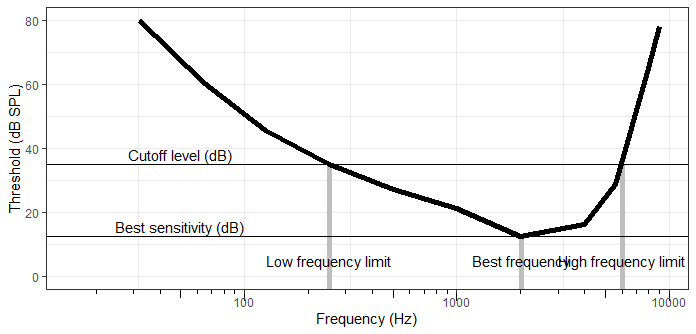

# Data files
> * "audiograms.csv"    - contains behavioural audiograms from literature                  
> * "databmadded.csv"  - contains anatomical data 
> * "Column name descriptions.csv"  describes the column names in the data file                   
> * "JZ tree Prum merged hackett.tree" - phylogeny

# Scaling stats
> * "Set up data_scl.R" - sets up data for analysis and runs pgls regressions
                      
# Audiograms linked to anatomy
> * "Audiograms linked to anatomy.R"   
Links to best sensitivity, high frequency limit, low frequency limit, and best frequency
>> * "pgls_audiogram_bs.R" (best sensitivity)              
>> * "pgls_audiogram_hf.R" (high frequency limit)              
>> * "pgls_audiogram_lf.R" (low frequency limit)  
>> * "pgls_audiogram_bh.R" (best frequency)

# Plotting

