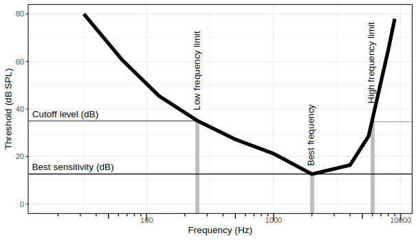
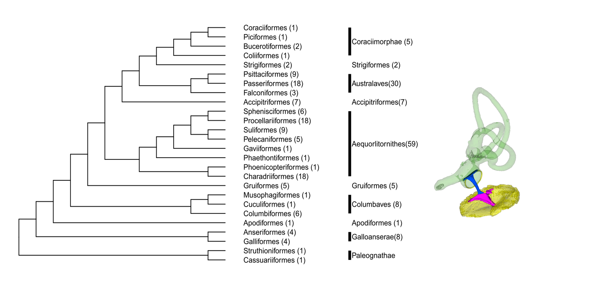

# Workflow
This work corresponds to in prep.

To reproduce the scaling analyses, start with "Set up data_scl.R".

The pgls between the ear structures and audiometric measurements are 

[Title] in prep. or recently submitted, with an abstract or a summary of the abstract of the paper. Then, a workflow of the scripts. To reproduce the analyses in the paper, where should I start? where should I go next?

# Data files
|File|Description|
|-----|-----|
|["databmadded.csv"](https://github.com/jzeyl/Scaling_2021/blob/main/databmadded.csv)|anatomical data|
|["Column name descriptions.csv"](https://github.com/jzeyl/Scaling_2021/blob/main/Column%20name%20descriptions.csv)|a file describing the column names in data files|
|["audiograms.csv"](https://github.com/jzeyl/Scaling_2021/blob/main/audiograms.csv)|threshold data from behavioural audiograms collected from literature|
|["JZ tree Prum merged hackett.tree"](https://github.com/jzeyl/Scaling_2021/blob/main/JZ%20tree%20Prum%20merged%20hackett.tree)|phylogeny file|

# Analysis scripts
## Scaling analyses

|File|Description|
|-----|-----|
|["Set up data_scl.R"](https://github.com/jzeyl/Scaling_2021/blob/main/Set%20up%20data_scl.R)|This is the main analysis script, which imports the data analysis and runs pgls regressions, calling formulas make in other R scripts. Outputs are tables with statistical results (hm, intra, bm) exported to csv or word.|
|"pgls_intraear.R"|list of pgls formula for scaling between auditory structures|
|"pgls_bm.R"|list of pgls formula against body mass|
|"pgls_HM.R"|list of pgls formula against head mass|

## Links to audiometry

|File|Description|
|-----|-----|
|"Audiograms linked to anatomy.R"|This is the main analysis script for analyses between anatomy and audiogram metrics. This script runs the pgls regressions, calling formulas make in other R scripts. Outputs are tables with statistical results exported to csv or word.|
|["pgls_audiogram_bs.R"](https://github.com/jzeyl/Scaling_2021/blob/main/pgls_audiogram_bs.R)|list of pgls for best sensitivity|
|["pgls_audiogram_hf.R"](https://github.com/jzeyl/Scaling_2021/blob/main/pgls_audiogram_hf.R)|list of pgls formula forhigh frequency limit|
|["pgls_audiogram_lf.R"]((https://github.com/jzeyl/Scaling_2021/blob/main/pgls_audiogram_hf.R))|list of pgls formula forlow frequency limit|
|["pgls_audiogram_bh.R"](https://github.com/jzeyl/Scaling_2021/blob/main/pgls_audiogram_hf.R)|list of pgls formula for best frequency| 

.
                      

# Plotting
|File|Description|
|-----|-----|
 |["Scatterplots relative to head mass.R"  ](https://github.com/jzeyl/Scaling_2021/blob/main/plots/1%20plot%20scatterplots_scl_hm.R)|Plotting of ear measures relative to head mass and body mass|
| "Scatterplots, between ear measures.R"  ](https://github.com/jzeyl/Scaling_2021/blob/main/plots/2%20plot_intra_april%2014.R)|Plotting of ear measure relative to each other|
|["Scatterplots relative to audiogram measures.R"](https://github.com/jzeyl/Scaling_2021/blob/main/plots/3%20plot%20link%20to%20anaomy%20Apr%2013.R)|Plotting of ear measures and audiogram data |
|["Audiogram bar plots_Supplemental.R"]   |Plots for supplemental material|
- 
[1]         
[2] 
[3]        
[4] 

<!---->

